# AgentMesh — Agentic Workflow

AgentMesh is a synchronous multi-agent orchestration system. It picks up tasks from NoteCove, assigns them to autonomous worker agents, and routes all user interaction through the Spokesman. Workers are never talked to directly by the user.

---

## System Layout

```
Session: orchestrator          ← user attaches here only
  window 0: main               ← /spokesman skill (Claude Code) — user-interaction layer
  window 1: dispatcher         ← scripts/dispatcher.sh (bash loop)
  window 2: watchdog           ← scripts/watchdog.sh (bash loop)
  window 3: folder-cleanup     ← scripts/folder-cleanup.sh (bash loop)
  window 4: orchestrator       ← scripts/orchestrator.py (Python daemon)
  window N: pr-mon-WORK-42     ← scripts/pr-monitor.sh (bash loop, one per PR-ready task)

Session: workers
  window 0: WORK-42            ← /worker skill (Claude Code, yolo mode)
  window 1: WORK-57            ← /worker skill (Claude Code, yolo mode)
  window N: plan-rev-WORK-42   ← /plan-reviewer skill (Claude Code, one per plan under review)
  window N: pr-rev-WORK-42     ← /pr-reviewer skill (Claude Code, one per PR under review)
  ...
```

---

## How the User Interacts

The user only ever interacts with the **Spokesman** — the single Claude Code session in the `orchestrator` tmux session. Behind it, the `orchestrator.py` daemon handles all event routing and worker lifecycle management automatically.

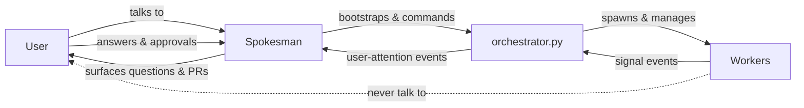

Workflow from the user's perspective:

1. Run `/spokesman --project WORK` to start (add `--mode auto-review` to enable automatic reviewing).
2. The Spokesman bootstraps the system; orchestrator.py picks up `Ready` tasks and dispatches agents automatically.
3. When a worker needs input or has a completed PR, orchestrator.py forwards the event to the Spokesman.
4. The Spokesman presents the event; the user responds — answering questions, approving or giving feedback.
5. The Spokesman relays the decision to orchestrator.py, which resumes the worker.

### Running Modes

The orchestrator supports two modes set via `--mode`:

| Mode | Plan reviews | PR reviews | User interrupted for |
|---|---|---|---|
| `standard` (default) | User decides: approve, spawn reviewer, or give feedback | User decides: approve, spawn reviewer, feedback, or abort | All Attention events |
| `auto-review` | Plan-reviewer spawns automatically; review passed to worker | PR-reviewer spawns automatically; review passed to worker; user approves final PR | Questions + final PR approval only |

In `auto-review` mode the reviewer verdict is not read by the orchestrator — the worker is always resumed regardless of verdict. For plan reviews, the worker reads the REVIEW note and decides how to proceed before implementing. For PR reviews, the reviewer posts its findings to the GitHub PR; the orchestrator passes the review back to the worker (sets task `Doing`), and the worker reads the PR comments, applies any fixes, and re-signals when ready. On the worker's next PR-ready signal, the orchestrator presents the PR to the user for final approval (no second auto-review). This keeps the orchestrator simple and avoids infinite review cycles.

### PR Event Translation

Workers always signal `event:pr-ready:<url>`. The orchestrator translates this into one of two Spokesman events depending on mode and context:

| Spokesman event | When | What the Spokesman shows |
|---|---|---|
| `event:pr-submitted:<url>` | Standard mode, first worker signal | "PR submitted" — options: approve, spawn reviewer, feedback, abort |
| `event:pr-ready:<url>` | Auto-review mode, post-review worker re-signal | "PR validated" — options: approve, feedback, abort (no reviewer option) |

This means `event:pr-ready` reaching the Spokesman always indicates the PR has already been reviewed and validated; no reviewer spawn is offered at that point.

---

## Orchestrator — Worker Relationship

### Task Pickup


### Signal Protocol

All coordination is synchronous — no polling or idle token consumption.

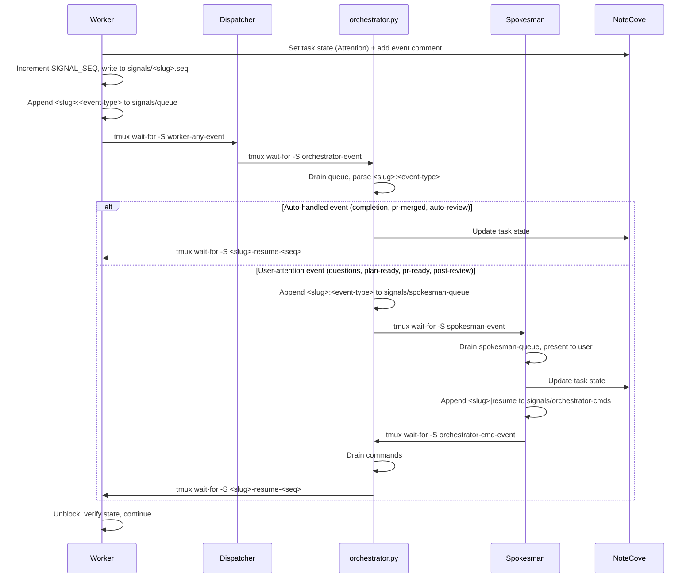

**Fan-in via dispatcher**: multiple workers can fire `worker-any-event` concurrently without losing events. The dispatcher serialises them into `orchestrator-event` one at a time.

**Sequenced resume signals** (`<slug>-resume-<N>`): each round uses a unique name, so a stale signal from round N-1 can never accidentally unblock round N.

**Queue format**: workers write `<slug>:<event-type>` (e.g. `WORK-abc:event:plan-ready`) so orchestrator.py knows the event type without reading NoteCove comments.

### Event Tag Dispatch

When a task reaches `Attention`, the orchestrator reads the **last comment** to determine the precise event type. Every agent adds a short `event:<type>` comment as the final comment before signaling. The orchestrator extracts this tag and dispatches via a `case` statement — no content heuristics.

| Event Tag | Fired by | Meaning |
|---|---|---|
| `event:questions` | Worker / Planner / Brainstormer | Agent has questions for the user |
| `event:plan-ready` | Worker | Plan note written, awaiting review |
| `event:pr-ready:<url>` | Worker | PR created at `<url>`, signaling readiness to orchestrator |
| `event:ideas-ready` | Brainstormer | New IDEAS note ready for user feedback |
| `event:selection-ready` | Brainstormer | SELECTION note ready for user to check ideas |
| `event:completion` | Brainstormer / Planner | Subtasks created (or skipped), parent marked Done |
| `event:plan-review-complete` | Plan Reviewer | Plan review note written, summary in comment |
| `event:pr-review-complete` | PR Reviewer | PR review posted to GitHub, summary in comment |

The orchestrator translates `event:pr-ready:<url>` from the worker into `event:pr-submitted:<url>` (standard mode, needs decision) or keeps it as `event:pr-ready:<url>` (auto-review mode, post-review, already validated) before forwarding to the Spokesman.

### Task State as the Only Message

The orchestrator never reads worker notes — **task state is the only coordination channel**.

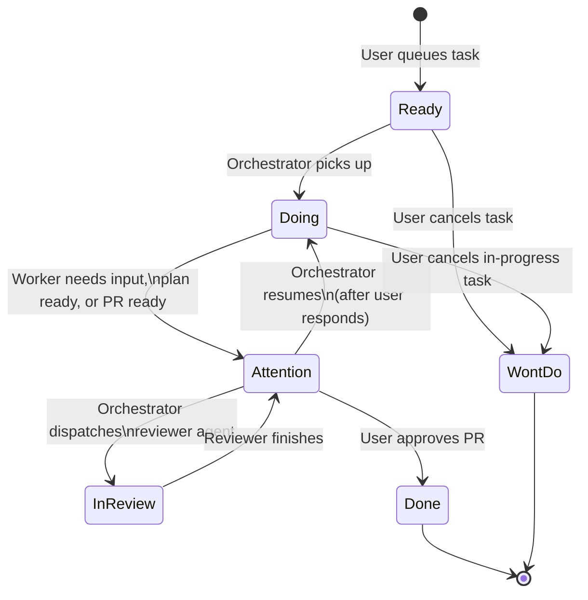

---

## Worker Types

### Normal Worker


### Planner

Spawned when a task is too large for a single PR (multiple independent components, distinct areas, explicit decomposition language).

Like a normal worker, a planner can also ask the user questions before proposing a decomposition — it signals `Attention` with a `QUESTIONS-N` note and blocks until the orchestrator resumes it with answers.

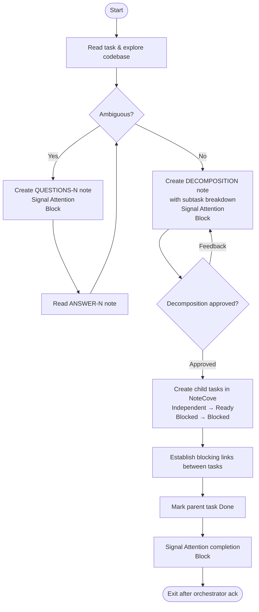

---

## Bootstrap

`scripts/bootstrap.sh` is called once by the Spokesman at startup. It encapsulates all Phase 0 setup:

1. **NoteCove init** — connects to the project and notes database.
2. **Signals directory** — creates `signals/`, clears the queue, spokesman-queue, orchestrator-cmds, worker registry, and event log, and removes stale `.merged`, `.reviewed`, and `.review-start` flags.
3. **Triage folder** — resolves the Triage folder ID from NoteCove and writes it to `signals/triage_folder` so orchestrator.py can reference it without a repeated lookup.
4. **Workers session** — creates the `workers` tmux session if it doesn't already exist.
5. **Dispatcher** — launches `scripts/dispatcher.sh` in `orchestrator:dispatcher`.
6. **Watchdog** — launches `scripts/watchdog.sh` in `orchestrator:watchdog`.
7. **Folder cleanup** — launches `scripts/folder-cleanup.sh` in `orchestrator:folder-cleanup`.
8. **Orchestrator daemon** — launches `scripts/orchestrator.py` in `orchestrator:orchestrator`.

Usage:
```bash
bash ~/agentmesh/scripts/bootstrap.sh --project WORK [--profile <id>] [--mode <mode>] [--max-workers <n>]
```

---

## Dispatcher

The dispatcher is a minimal bash loop (`scripts/dispatcher.sh`) that provides **fan-in from many workers to the single orchestrator**:

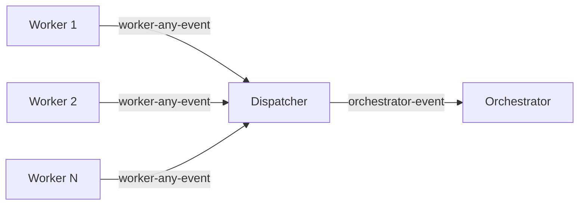

```bash
while true; do
  tmux wait-for "worker-any-event"
  tmux wait-for -S "orchestrator-event"
done
```

Without the dispatcher the orchestrator would need to know which signal to wait on. With it, the orchestrator always blocks on a single signal name, and the dispatcher serialises concurrent worker events.

---

## Watchdog

The watchdog (`scripts/watchdog.sh`) detects crashed workers and automatically recovers them.

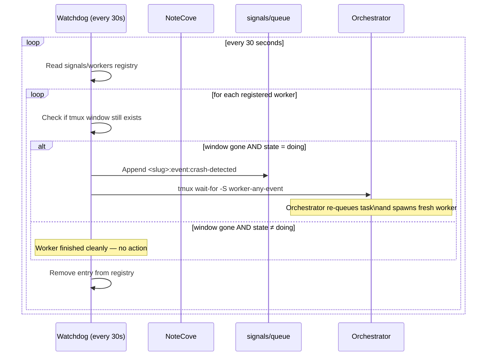

**Crash detection latency**: at most 60 seconds (two poll cycles).

---

## Anomaly Detection

`orchestrator.py` runs 4 lightweight invariant checks after every event it processes. New violations are logged to `events.log` with the `anomaly-detected:<key>` event type and escalated to the Spokesman for user notification. When a violation clears, an `anomaly-resolved:<key>` entry is logged.

| Check | Anomaly key | Condition |
|---|---|---|
| 1 | `reviewer-stuck:<slug>` | `signals/<slug>.review-start` exists and is older than 15 minutes |
| 2 | `orphaned-reviewer:<slug>:<window>` | A `plan-rev-*` or `pr-rev-*` window exists but the task is not in `in-review` state |
| 3 | `stale-registry:<slug>` | Slug is in `signals/workers` but its tmux window no longer exists |
| 4 | `contradictory-flags:<slug>` | Both `signals/<slug>.reviewed` and `signals/<slug>.merged` exist simultaneously |

**De-duplication**: the orchestrator tracks active anomalies in memory; each anomaly is reported only once when first detected and again only if it reappears after clearing.

**Review-start tracking**: `orchestrator.py` touches `signals/<slug>.review-start` whenever it spawns a reviewer (plan or PR) and removes it when the review completes or the reviewer is killed. Bootstrap clears any stale `.review-start` files from prior runs.

---

## Folder Cleanup

The folder cleanup daemon (`scripts/folder-cleanup.sh`) moves task subfolders for terminal tasks into the adjacent `Done` folder — asynchronously, without requiring the orchestrator to call a folder-move helper inline.

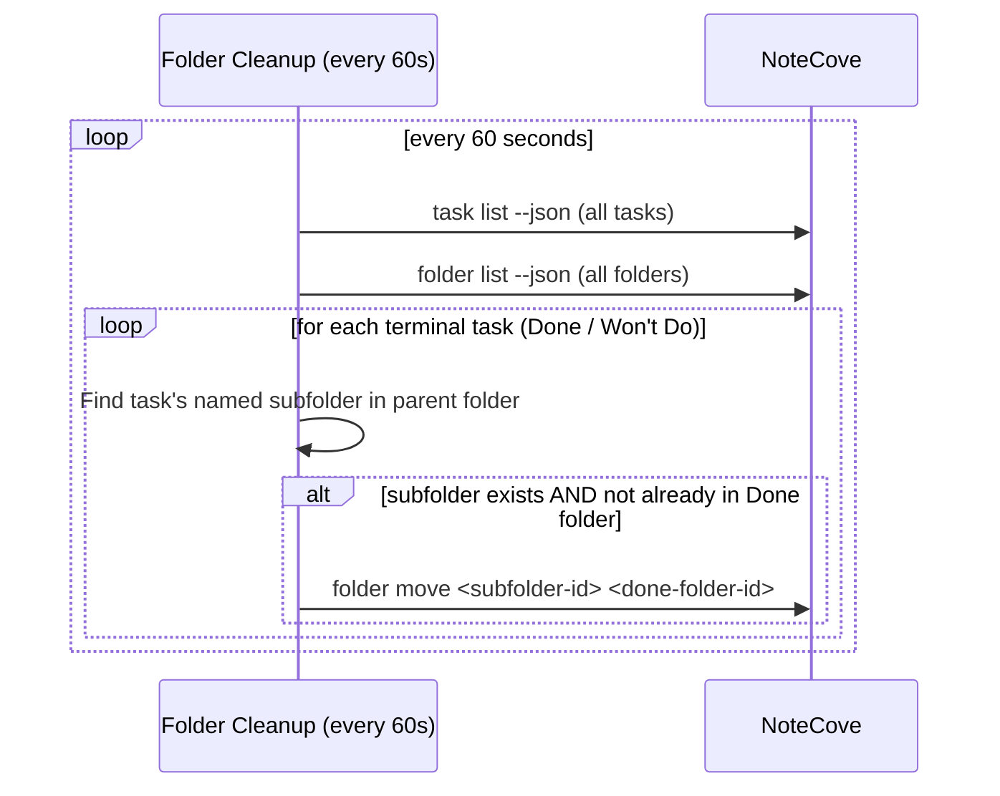

This replaces the inline `move_task_folder_to_done` helper that was previously called in each terminal path of the orchestrator skill, removing ~25 lines of repeated shell/Python from the skill.

**Idempotent**: the daemon checks whether the subfolder is already under a `Done` folder before attempting a move, so repeated poll cycles are safe.

---

## PR Monitor

The pr-monitor (`scripts/pr-monitor.sh`) polls a PR's state and triggers auto-approval when it is merged — removing the need for the user to manually approve.

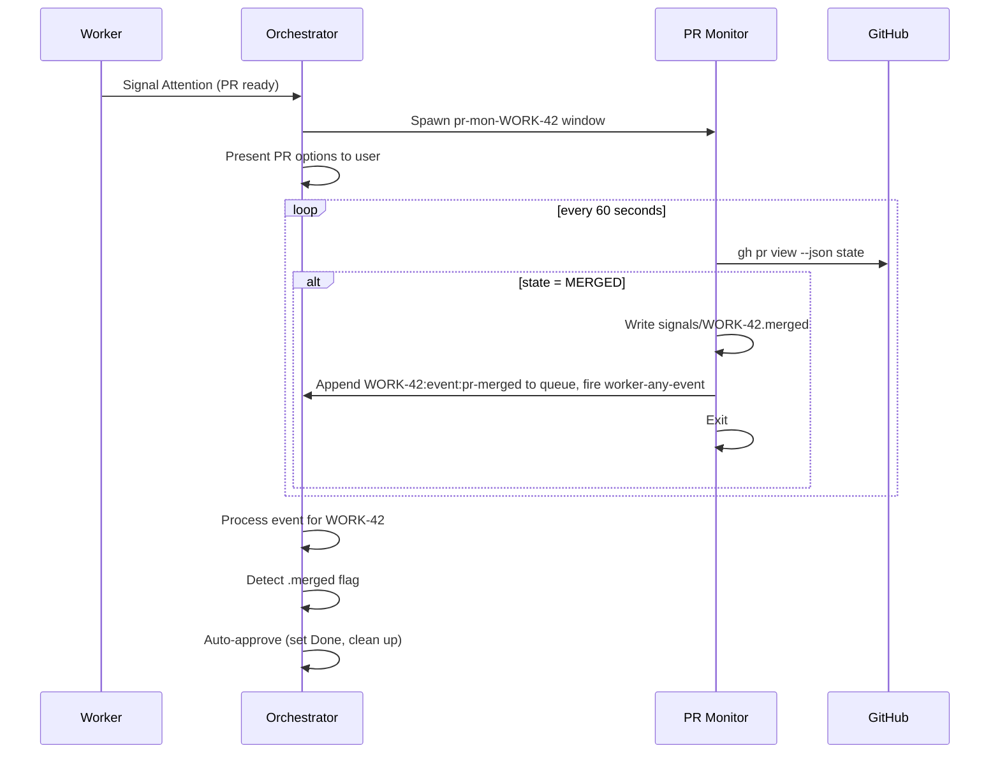

**Auto-approval latency**: up to 60 seconds after the PR is merged (one poll cycle).

**Known limitation**: if the PR merges while the user is actively reviewing the PR-ready prompt, the auto-approval is deferred to the next event loop iteration. In practice this is harmless — whichever action completes first wins.

---

## Agent Spawner

`scripts/spawn-agent.sh` is a helper that encapsulates the repeated four-line pattern for launching a Claude agent in a new tmux window:

```bash
bash ~/agentmesh/scripts/spawn-agent.sh <session> <window-name> <skill> <task-slug> <project>
```

It runs `new-window`, starts Claude in yolo mode, waits 3 seconds for the shell to initialize, then sends the skill invocation. Used by the orchestrator to spawn workers, planners, brainstormers, plan-reviewers, and pr-reviewers.

---

## Task Cleanup Helper

`scripts/task-done.sh` is called by the orchestrator whenever a task reaches a terminal state (Done, Won't Do). It consolidates the cleanup steps that are common to every task completion path.

```bash
bash scripts/task-done.sh <slug> <PROJECT> [<resume-sig>]
```

It performs, in order:
1. **Resume signal** (optional) — if `<resume-sig>` is provided, fires `tmux wait-for -S <resume-sig>` to unblock the worker before its windows are killed.
2. **Kill worker windows** — `workers:<slug>`, `workers:plan-rev-<slug>`, `workers:pr-rev-<slug>`.
3. **Unregister** — removes the worker entry from `signals/workers` (no-op if the file is missing).
4. **Remove seq file** — deletes `signals/<slug>.seq`.
5. **Unblock dependents** — retries up to 3 times (2 s apart) to find and unblock any task whose only remaining non-terminal blocker was `<slug>`.

Use `<resume-sig>` when the worker is blocked waiting (normal Done path). Omit it when the worker is already gone (crash path, external abort).

---

## End-to-End Example Workflow

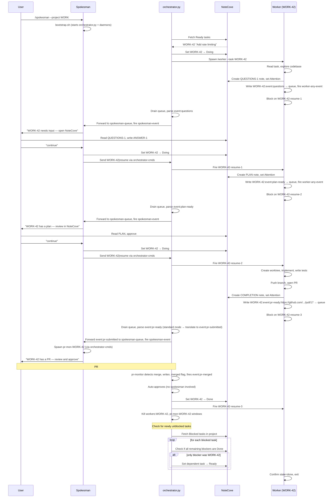

---

## Why NoteCove?

| Benefit | Detail |
|---|---|
| **Lightweight tasks** | Tasks hold only title, state, priority, and a brief description. Implementation details live in notes — tasks stay scannable. |
| **Context belongs to the worker** | The orchestrator reads task state only, never notes. Workers own their scratchpad. Orchestrator stays simple regardless of task complexity. |
| **Shared workspace** | User and agents operate in the same space. Questions, plans, and completion summaries are notes the user reads naturally — no external ticketing system. |
| **State as coordination primitive** | Task state transitions *are* the messages. No extra status files, no JSON payloads, no side channels. |
| **Crash resilience** | Workers restore context from existing notes on restart. No work is lost if a worker crashes. |
| **Proactive knowledge capture** | Workers file triage tasks for bugs, doc gaps, or concerns into a shared Triage folder — visible to user and future agents immediately. |

---

## How NoteCove Is Used

### Task States

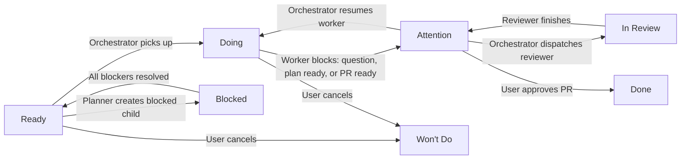

| State | Who sets it | Meaning |
|---|---|---|
| `Ready` | User / Planner | Task is queued for pickup |
| `Doing` | Orchestrator / Worker | Task is actively being worked |
| `Attention` | Worker / Planner | Needs user attention — questions, plan ready, PR ready, or post-review |
| `In Review` | Orchestrator only | A reviewer agent is currently running |
| `Blocked` | Planner | Task is waiting on a dependency |
| `Done` | Orchestrator | Fully approved and complete |
| `Won't Do` | User | Task was cancelled — no work will be done |

### Priority

Standard **P1–P4** scale. The orchestrator dispatches the highest-priority `Ready` tasks first.

### Notes for Context Persistence

Each task gets a dedicated folder. Workers create notes there throughout their lifecycle:

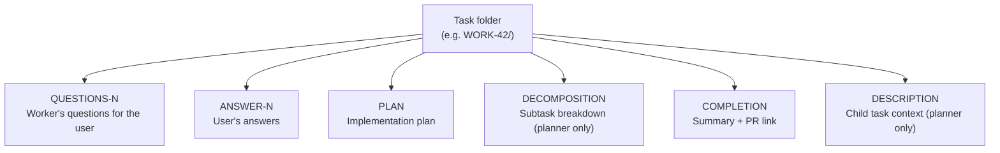

Notes keep detailed context out of the task record. If a worker crashes and is restarted, it reads existing notes to restore context — no work is lost.

### Answering Worker Questions

When a worker signals `Attention` with a `QUESTIONS-N` note, the user has two ways to answer:

- **Via the orchestrator session** — type the answer in-session; the orchestrator writes it to NoteCove and resumes the worker.
- **Inline in the QUESTIONS note** — edit the note directly in NoteCove, writing answers beneath each question. The worker reads the updated note after being resumed.

The inline approach keeps questions and answers together in one place, making the conversation easy to review later.

---

## Reliability — Orchestrator Heartbeat

To protect against a silently crashed orchestrator, `orchestrator.py` writes a **heartbeat file** (`signals/orchestrator.heartbeat`) every 30 seconds and on every event it processes. The Spokesman checks this file's modification time after each `spokesman-event` wakeup.

**Staleness threshold:** 90 seconds (3 missed heartbeat intervals).

If the heartbeat is stale, the Spokesman:
1. Logs `spokesman:orchestrator-restarted` to `events.log`
2. Kills the `orchestrator:orchestrator` tmux window
3. Re-creates the window and re-runs the exact launch command stored in `signals/orchestrator-restart-cmd`
4. Informs the user that the orchestrator was restarted

`signals/orchestrator-restart-cmd` is written by `bootstrap.sh` on every bootstrap and contains the full `python3 scripts/orchestrator.py --project ... --mode ... --max-workers ... --profile ...` command used to launch orchestrator.py.

The Spokesman does not require user confirmation to restart — the restart is automatic, non-blocking, and transparent. The worker event queue is persistent (append-only files), so in-flight events are not lost on restart.
