# AgentMesh — Agentic Workflow

AgentMesh is a synchronous multi-agent orchestration system. It picks up tasks from NoteCove, assigns them to autonomous worker agents, and routes all user interaction through a single orchestrator. Workers are never talked to directly by the user.

---

## System Layout

```
Session: orchestrator          ← user attaches here only
  window 0: main               ← /orchestrator skill (Claude Code)
  window 1: dispatcher         ← scripts/dispatcher.sh (bash loop)
  window 2: watchdog           ← scripts/watchdog.sh (bash loop)
  window 3: folder-cleanup     ← scripts/folder-cleanup.sh (bash loop)
  window N: pr-mon-WORK-42     ← scripts/pr-monitor.sh (bash loop, one per PR-ready task)

Session: workers
  window 0: WORK-42            ← /worker skill (Claude Code, yolo mode)
  window 1: WORK-57            ← /worker skill (Claude Code, yolo mode)
  ...
```

---

## How the User Interacts

The user only ever interacts with the **orchestrator** — the single Claude Code session in the `orchestrator` tmux session.

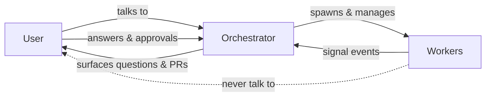

Workflow from the user's perspective:

1. Run `/orchestrator --project WORK` to start (add `--mode auto-review` to enable automatic reviewing).
2. The orchestrator picks up `Ready` tasks and dispatches agents automatically.
3. When a worker needs input or has a completed PR (both signaled as `Attention`), the orchestrator surfaces it.
4. The user responds in the orchestrator session — answering questions, approving or giving feedback.
5. The orchestrator relays everything to the worker and resumes it.

### Running Modes

The orchestrator supports two modes set via `--mode`:

| Mode | Plan reviews | PR reviews | User interrupted for |
|---|---|---|---|
| `standard` (default) | User decides: approve, spawn reviewer, or give feedback | User decides: approve, spawn reviewer, feedback, or abort | All Attention events |
| `auto-review` | Plan-reviewer spawns automatically; review passed to worker | PR-reviewer spawns automatically; review passed to worker; user approves final PR | Questions + final PR approval only |

In `auto-review` mode the reviewer verdict is not read by the orchestrator — the worker is always resumed regardless of verdict. For plan reviews, the worker reads the REVIEW note and decides how to proceed before implementing. For PR reviews, the reviewer posts its findings to the GitHub PR; the orchestrator passes the review back to the worker (sets task `Doing`), and the worker reads the PR comments, applies any fixes, and re-signals when ready. On the worker's next PR-ready signal, the orchestrator presents the PR to the user for final approval (no second auto-review). This keeps the orchestrator simple and avoids infinite review cycles.

---

## Orchestrator — Worker Relationship

### Task Pickup

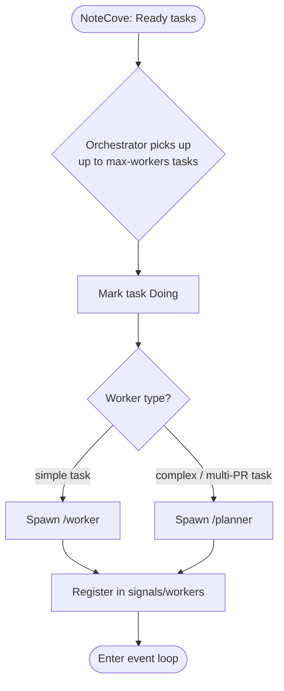

### Signal Protocol

All coordination is synchronous — no polling or idle token consumption.

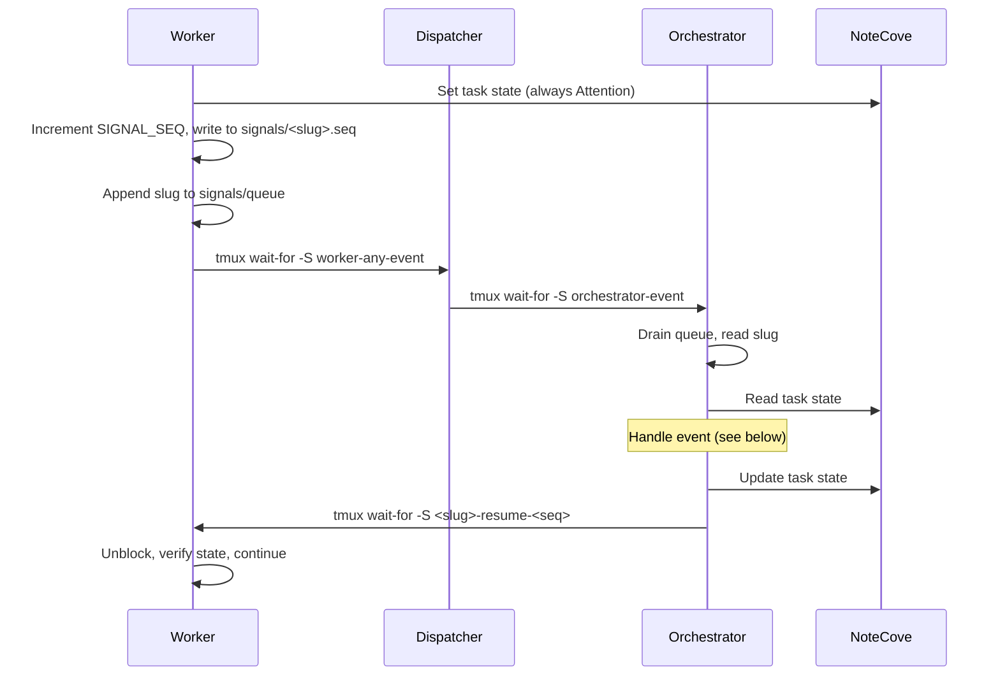

**Fan-in via dispatcher**: multiple workers can fire `worker-any-event` concurrently without losing events. The dispatcher serialises them into `orchestrator-event` one at a time.

**Sequenced resume signals** (`<slug>-resume-<N>`): each round uses a unique name, so a stale signal from round N-1 can never accidentally unblock round N.

### Task State as the Only Message

The orchestrator never reads worker notes — **task state is the only coordination channel**.

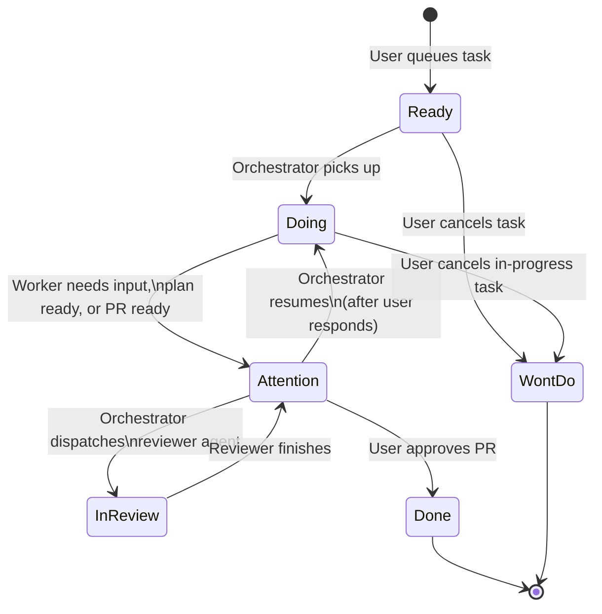

---

## Worker Types

### Normal Worker

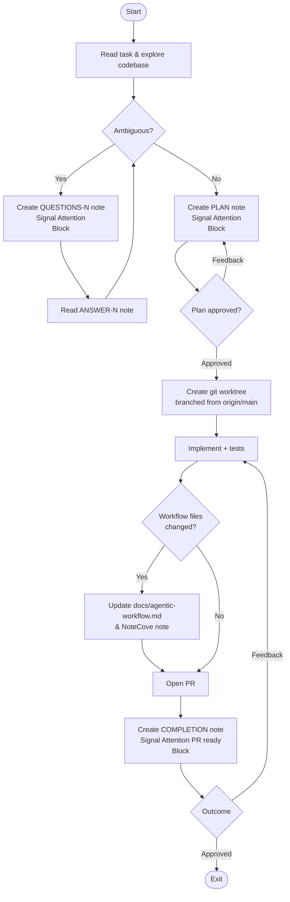

### Planner

Spawned when a task is too large for a single PR (multiple independent components, distinct areas, explicit decomposition language).

Like a normal worker, a planner can also ask the user questions before proposing a decomposition — it signals `Attention` with a `QUESTIONS-N` note and blocks until the orchestrator resumes it with answers.


---

## Bootstrap

`scripts/bootstrap.sh` is called once by the orchestrator at startup. It encapsulates all Phase 0 setup:

1. **NoteCove init** — connects to the project and notes database.
2. **Signals directory** — creates `signals/`, clears the queue, worker registry, and event log, and removes stale `.merged` and `.reviewed` flags.
3. **Triage folder** — resolves the Triage folder ID from NoteCove and writes it to `signals/triage_folder` so the orchestrator can reference it without a repeated lookup.
4. **Workers session** — creates the `workers` tmux session if it doesn't already exist.
5. **Dispatcher** — launches `scripts/dispatcher.sh` in `orchestrator:dispatcher`.
6. **Watchdog** — launches `scripts/watchdog.sh` in `orchestrator:watchdog`.
7. **Folder cleanup** — launches `scripts/folder-cleanup.sh` in `orchestrator:folder-cleanup`.

Usage:
```bash
bash /Users/firas.gara/agentmesh/scripts/bootstrap.sh --project WORK [--profile <id>]
```

---

## Dispatcher

The dispatcher is a minimal bash loop (`scripts/dispatcher.sh`) that provides **fan-in from many workers to the single orchestrator**:

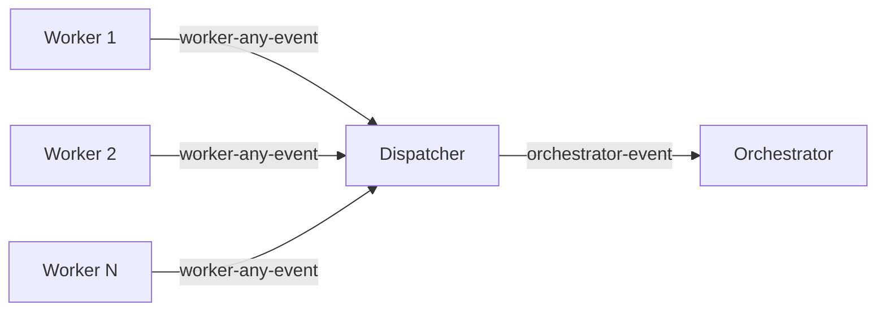

```bash
while true; do
  tmux wait-for "worker-any-event"
  tmux wait-for -S "orchestrator-event"
done
```

Without the dispatcher the orchestrator would need to know which signal to wait on. With it, the orchestrator always blocks on a single signal name, and the dispatcher serialises concurrent worker events.

---

## Watchdog

The watchdog (`scripts/watchdog.sh`) detects crashed workers and automatically recovers them.


**Crash detection latency**: at most 60 seconds (two poll cycles).

---

## Folder Cleanup

The folder cleanup daemon (`scripts/folder-cleanup.sh`) moves task subfolders for terminal tasks into the adjacent `Done` folder — asynchronously, without requiring the orchestrator to call a folder-move helper inline.

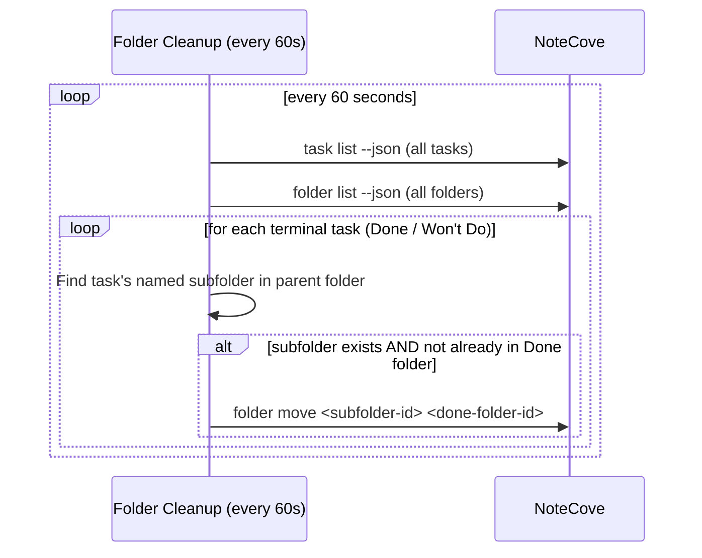

This replaces the inline `move_task_folder_to_done` helper that was previously called in each terminal path of the orchestrator skill, removing ~25 lines of repeated shell/Python from the skill.

**Idempotent**: the daemon checks whether the subfolder is already under a `Done` folder before attempting a move, so repeated poll cycles are safe.

---

## PR Monitor

The pr-monitor (`scripts/pr-monitor.sh`) polls a PR's state and triggers auto-approval when it is merged — removing the need for the user to manually approve.

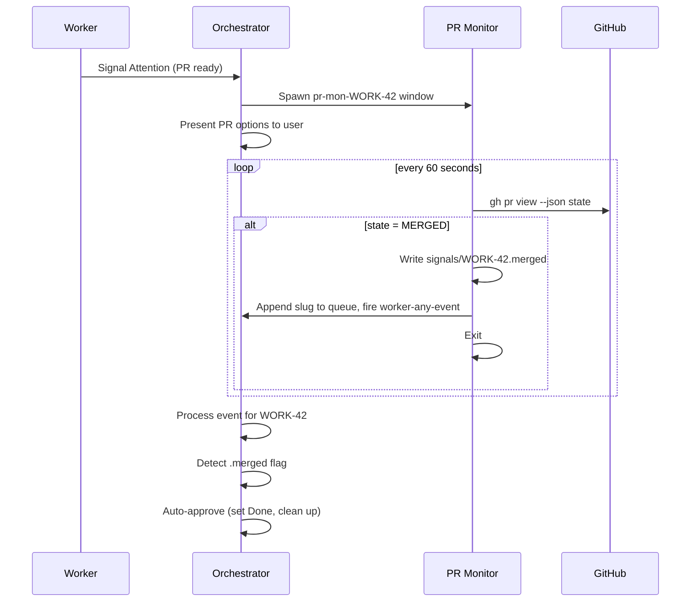

**Auto-approval latency**: up to 60 seconds after the PR is merged (one poll cycle).

**Known limitation**: if the PR merges while the user is actively reviewing the PR-ready prompt, the auto-approval is deferred to the next event loop iteration. In practice this is harmless — whichever action completes first wins.

---

## Agent Spawner

`scripts/spawn-agent.sh` is a helper that encapsulates the repeated four-line pattern for launching a Claude agent in a new tmux window:

```bash
bash /Users/firas.gara/agentmesh/scripts/spawn-agent.sh <session> <window-name> <skill> <task-slug> <project>
```

It runs `new-window`, starts Claude in yolo mode, waits 3 seconds for the shell to initialize, then sends the skill invocation. Used by the orchestrator to spawn workers, planners, brainstormers, plan-reviewers, and pr-reviewers.

---

## End-to-End Example Workflow

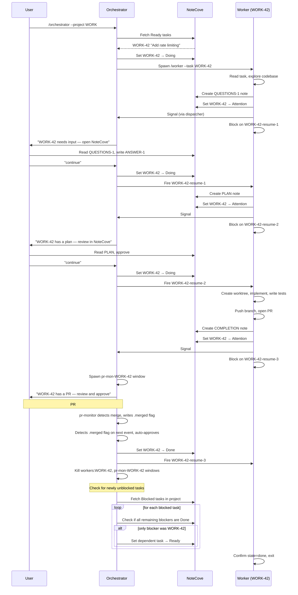

---

## Why NoteCove?

| Benefit | Detail |
|---|---|
| **Lightweight tasks** | Tasks hold only title, state, priority, and a brief description. Implementation details live in notes — tasks stay scannable. |
| **Context belongs to the worker** | The orchestrator reads task state only, never notes. Workers own their scratchpad. Orchestrator stays simple regardless of task complexity. |
| **Shared workspace** | User and agents operate in the same space. Questions, plans, and completion summaries are notes the user reads naturally — no external ticketing system. |
| **State as coordination primitive** | Task state transitions *are* the messages. No extra status files, no JSON payloads, no side channels. |
| **Crash resilience** | Workers restore context from existing notes on restart. No work is lost if a worker crashes. |
| **Proactive knowledge capture** | Workers file triage tasks for bugs, doc gaps, or concerns into a shared Triage folder — visible to user and future agents immediately. |

---

## How NoteCove Is Used

### Task States

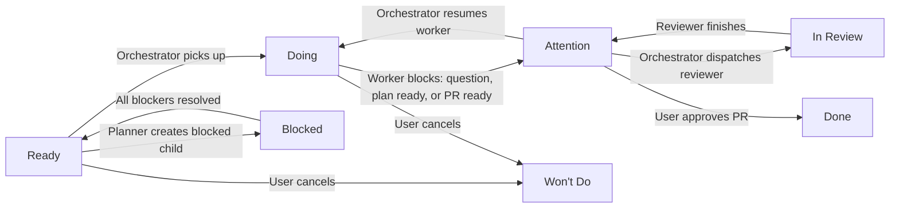

| State | Who sets it | Meaning |
|---|---|---|
| `Ready` | User / Planner | Task is queued for pickup |
| `Doing` | Orchestrator / Worker | Task is actively being worked |
| `Attention` | Worker / Planner | Needs user attention — questions, plan ready, PR ready, or post-review |
| `In Review` | Orchestrator only | A reviewer agent is currently running |
| `Blocked` | Planner | Task is waiting on a dependency |
| `Done` | Orchestrator | Fully approved and complete |
| `Won't Do` | User | Task was cancelled — no work will be done |

### Priority

Standard **P1–P4** scale. The orchestrator dispatches the highest-priority `Ready` tasks first.

### Notes for Context Persistence

Each task gets a dedicated folder. Workers create notes there throughout their lifecycle:

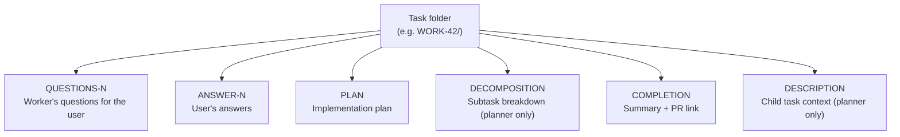

Notes keep detailed context out of the task record. If a worker crashes and is restarted, it reads existing notes to restore context — no work is lost.

### Answering Worker Questions

When a worker signals `Attention` with a `QUESTIONS-N` note, the user has two ways to answer:

- **Via the orchestrator session** — type the answer in-session; the orchestrator writes it to NoteCove and resumes the worker.
- **Inline in the QUESTIONS note** — edit the note directly in NoteCove, writing answers beneath each question. The worker reads the updated note after being resumed.

The inline approach keeps questions and answers together in one place, making the conversation easy to review later.
